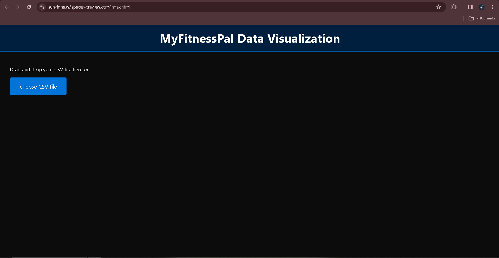
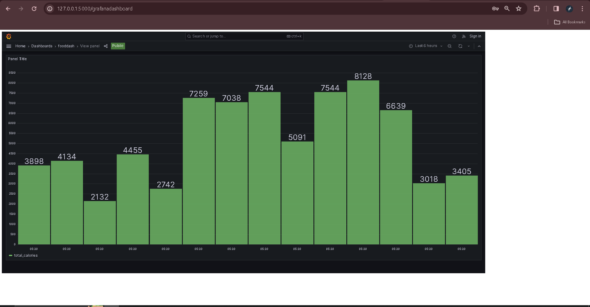
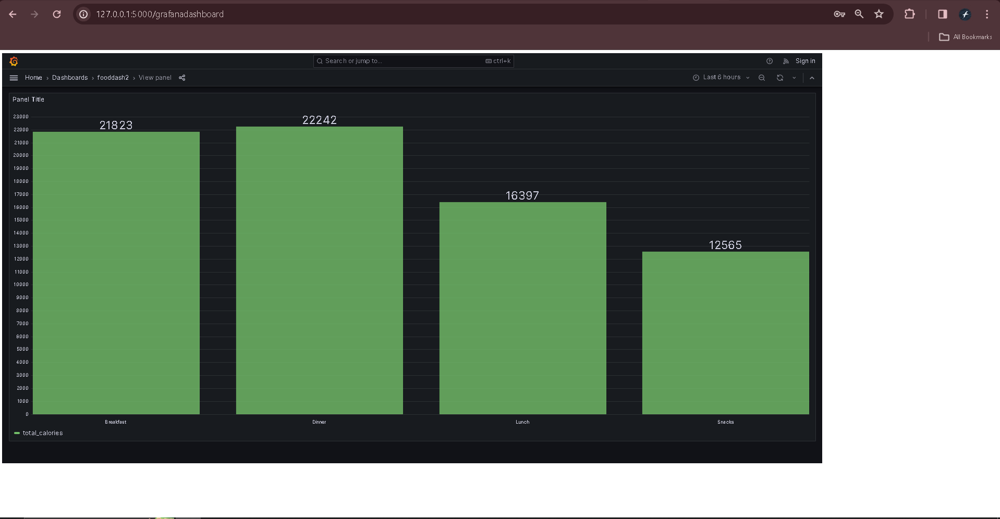
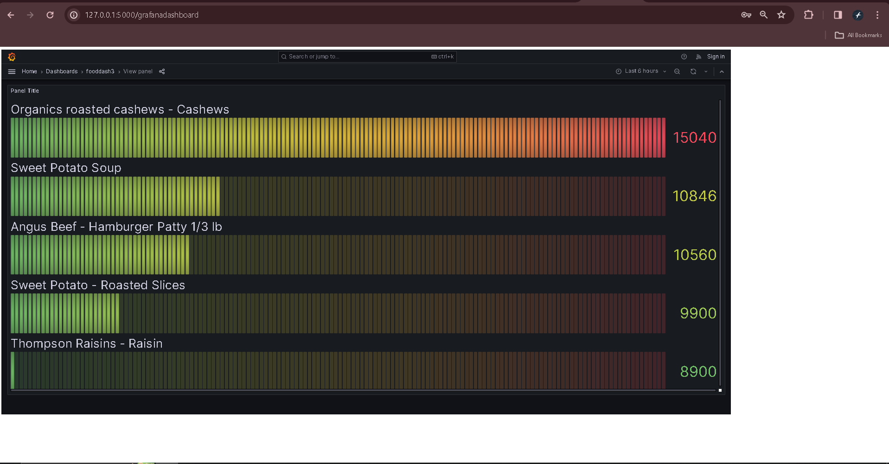
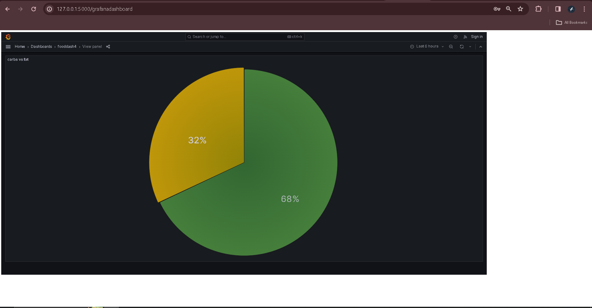

# Grafana-Myfitnesspal-project
 A simple website that accepts CSV exports and renders nice visual representations using Grafana would be much better for users.
 
## Problem Statement:
https://ccextractor.org/public/gsoc/takehome/#export-data-from-myfitnesspal-to-grafana
Language: Any
Must work in: Linux (anything server side)
MyFitnessPal is a mobile app used to track food & energy intake, exercise, and more. It supports CSV data export (e.g. through email) to facilitate archival, but this style is a bit antiquated for manual viewing.
A simple website that accepts CSV exports and renders nice visual representations using Grafana would be much better for users. This should be feasible to complete in a few days since all of the major components already exist.

## Solution:
This Application take CSV file as an input -> convert into sql table -> Load into SQL Table -> Grafana Dashboard is generated based on the data of SQL Table.

## Technologies Used:
1) Python Flask
2) MYSQL
3) Grafana
   
## Python Libraries used:
1) sqlalchemy
2) pandas

## How does Application Work?
At the Home screen, User will have an option for uploading CSV file to the Application. After file uploading process ,it gets load into SQL table and then it get redirected to an Grafana Dashboard Page.

## screenshorts of the website and dashboards

)
)
)
)
)

I have written a blog on how to implement this project
link to blog: https://medium.com/@sunainha7/integrating-myfitnesspal-data-with-grafana-a-technical-guide-ab035e86d389 
